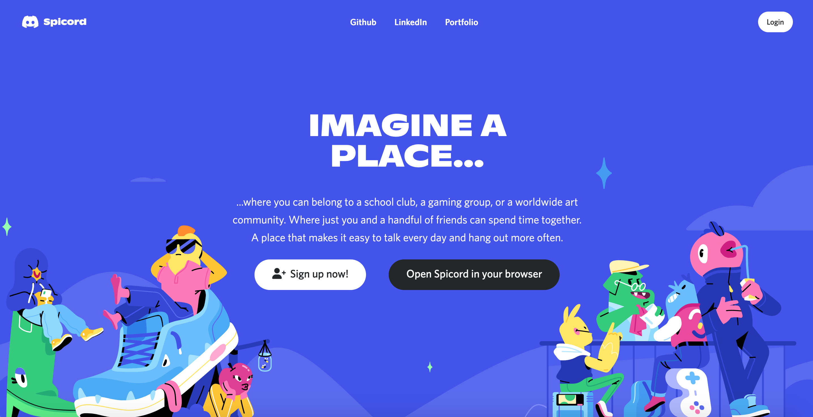
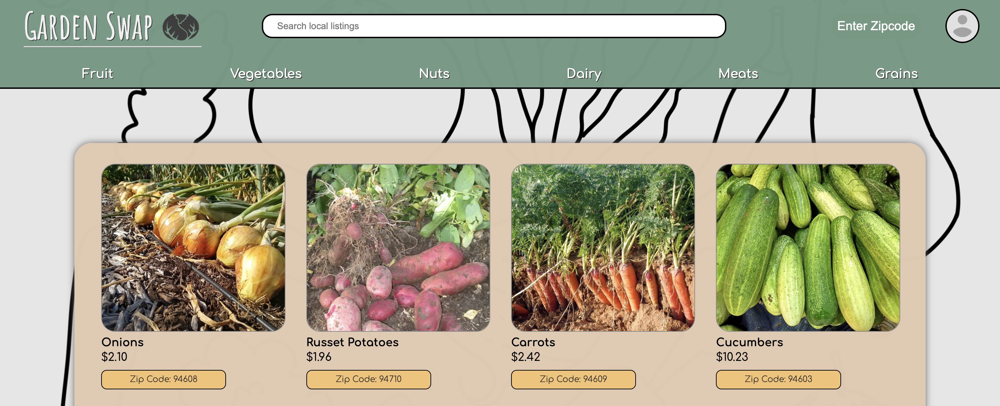
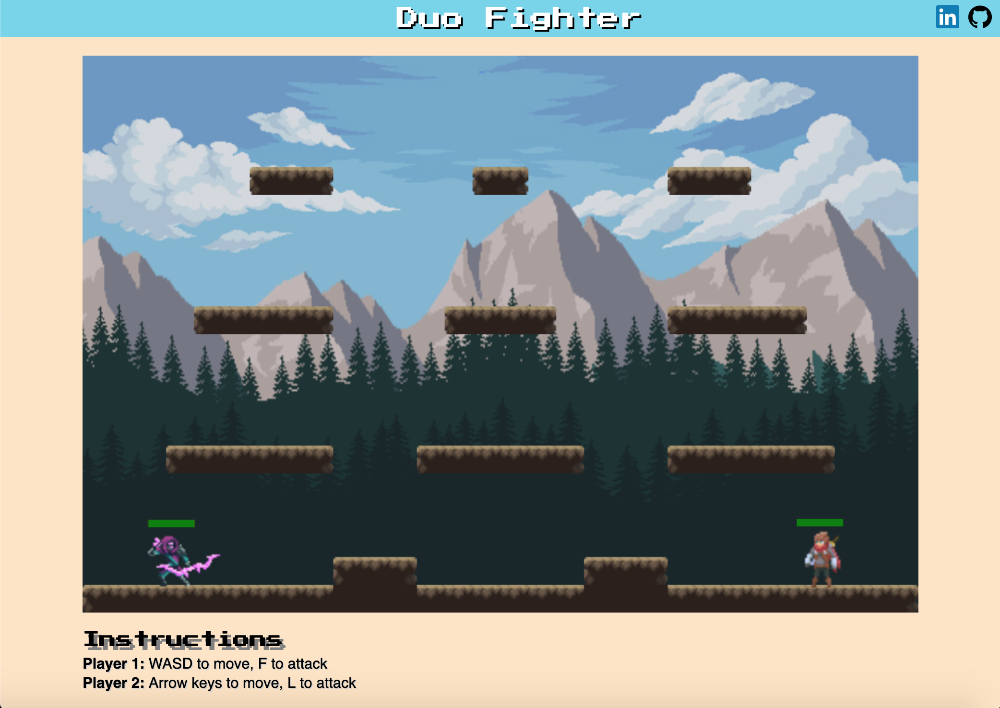

<h2>Hello, I'm Brian!</h2>
 
I am a full-stack software engineer passionate about continuous self-development and collaboration. 

Check out some of my projects: 

 
Spicord

  
 
  
 
 Technologies Used:

  
 
 
 
 
 
 
 
 
 
 

 
 

 
Garden Swap

  
 
  
 
 Technologies Used: 

  
 
 
  
 
 
 
 
 
 
 
 

 
Duo Fighter

  
 
  
 
 Technologies Used: 
 
  
 
 
 
 
 

### Languages and Tools:

 

  

 

 

 

 

 

---
### GitHub Stats:

---

<!-- ### Contact Me: -->
<h3>Contact Me: </h3>

 

